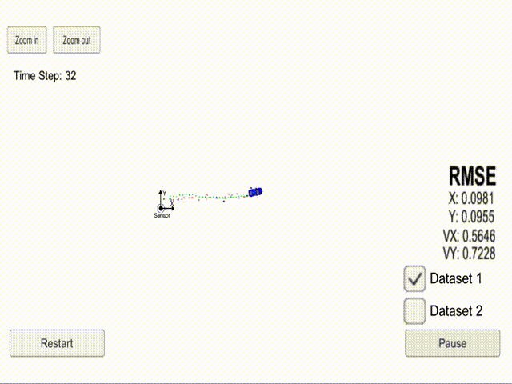

# Extended Kalman Filter (EKF) Project

| **Source Code**  | [https://github.com/aurangzaib/CarND-Extended-Kalman-Filter-Project](https://github.com/aurangzaib/CarND-Extended-Kalman-Filter-Project)  |
|:-----------|:-------------|
| **Overview**  | `README.md`  |
| **Setup**  | `SETUP.md`  |
| **EKF Implementation**| `src/kalman_filter.cpp`|
| **Measurement data**  | `data/obj_pose-laser-radar-synthetic-input.txt`     |
| **How to run**  | `mkdir build && cd build` | 
| |`cmake .. && make`     |
| |`./ExtendedKF`     |

## Introduction:

Extended Kalman Filter algorithm is used to predict is the position (px, py) and velocity (vx, vy) based on Laser and Radar data provided by car (simulator).

The accuracy of the prediction is calculated using RMSE method.

The steps of the project are as following:

- Read the sensors data and ground truth values from Laser and Radar

- Initialize Extended Kalman Filter

- Predict State Vector (`x`) and State Covariance (`P`)

- Update `x` and `P` for Laser

- Update `x` and `P` for Radar

- Calculate Root Mean Square Error (`RMSE`) to get the accuracy of estimation against the ground truth values.

## Sensor data and Predicted data:

The data provided by Laser sensor is in following form:

| px | py | timestamp | gt_px | gt_px | gt_vx | gt_vy |
|:-----------|:-------------|:-----------|:-------------|:-----------|:-------------|:-----------|

The data provided by Radar sensor is in following form:

| tho | psi | rho_dot | timestamp | gt_px | gt_px | gt_vx | gt_vy |
|:-----------|:-------------|:-----------|:-------------|:-----------|:-------------|:-----------|:-----------|

The data provided by server using Extended Kalman Filter is in following form:

| est_px | est_py | est_vx | est_vy | mse | 
|:-----------|:-------------|:-----------|:-------------|:-----------|

## Explanation of the code:

The implementation of EKF is divided into 4 files:

`main.cpp`

`fusion_ekf.cpp `

`kalman_filter.cpp`

`tools.cpp`

Following table summarizes the purpose of each file:

| File | Explanation |
|:-----------|:-------------|
|**main.cpp**| |
|				| Get measurement data of Laser and Radar from simulator |
| 				| Call `ProcessMeasurement` method of class `FusionEKF` | 
|				| Get estimated position (px, py) and velocity (vx, vy) |
|				| Call `CalculateRMSE` method of class `Tools` to get RMSE value|
|**fusion_ekf.cpp**|  |
| 				| Initialize `x`, `P`, `R_laser`, `R_radar`, `H_laser`, `F` and `Q` | 
|				| Call `Predict` of class `KalmanFilter`|
|				| Call `UpdateRadar` and `UpdateLaser` of class `KalmanFilter`|
|**kalman_filter.cpp**|  |
| 				| Implement `Predict` step of Kalman Filter | 
|				| Implement `Update` step for Laser measurements |
|				| Implement `UpdateEKF` step for Radar measurements |
|**tools.cpp**|  |
| 				| Implement `CalculateRMSE` to find RMSE values | 
|				| Implement `CalculateJacobian` to linearize sensor measurements from Radar |

## Results

Following points sum up the results and conclusion for EKF:

- EKF is able to handle linear as well as non-linear sensor measurements

- Angle `rho` normlization is required in Update step in case of Radar measurements

- EKF deals with non-linear measurements by linearizing them using Jacobian Matrix which is not an efficient way of handling non-linearities and losses accuracy in the process

- Unscetned Kalman Filter (EKF) can be used to further reduce RMSE as it handles non-linear measurements using a better mathematical model without needing the linearization step

- Update `x` and `P` for Radar

The video (GIF) below shows results of EKF:

